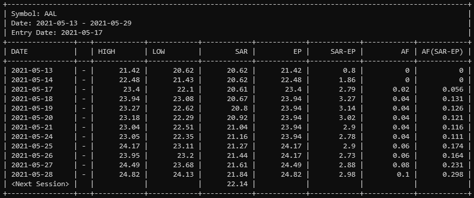

# psarf

> psarf utilizes the [Parabolic Sar Indicator](https://en.wikipedia.org/wiki/Parabolic_SAR) as a formula for a trailing stop mechanism.

# The Basic idea

The Parabolic Sar (Psar) Indicator, in a nutshell, provides an indication of direction. If Long, the Psar will draw points below the price trailing up each period till the price moves below that day's Psar triggering a reversal and reversing the process in the other direction. Continuing a loop of trail and stop, trail and stop.

While the Psar Indicator, of course, can be used on it's own. I do not use it as a trading signal, but very much like the trailing aspect of it. And pulled the formula out to use one half of the indicator as a trailing stop mechanic.

---

<small>Figure 1 - AAL with default Parabolic Sar Indicator (blue dots) with Psarf overlay (gold dottled line)</small>

In Figure 1, you can see on May 9th AAL traded up through the downward Psar triggering a reversal in the Psar, and now switching sides to start at the nearest pivot low of April 21st. While this is all fine and well. My desired entry is above the high of May 10th (the day after the Psar turn), and I wanted my stop to be at the pivot low of May 13.

Psarf takes the Parabolic Sar formula and starts it at the trigger bar, on May 17 (indicated by the label StartDate), and uses the May 13th low as the initial Psar value. The gold dotted line shows an estimated curve of the output Psar values given those two points. __This gives me the Psar independent of the Psar. Using 2 specific points I define, versus points dictated by the indicator itself.__

---

__Why not just use the Psar?__

I don't like the indicator itself. However, the trailing function of the formula works extremely well for my trading style.

__Why is this in Golang and not in Trading View or TradeStation's own DSLs?__

As far as I know, there isn't a simple or elegant way to define the two points, StartDate and the Pivot Low point without hardcoding them in specifically for trades that I've taken. TradeStation does provide a good amount of Trade data one can use. But Pivot Low points aren't as natural as the one in Figure 1, and input values are shared across all symbols.

*By the way, if anyone reading this knows how one can do this, please let me know!.*

__If this is not in my trading platforms, how do you use it?__

I built a command line tool around psarf that takes data from an outside source, like Yahoo Finance, and calculates the Psar data so I can use that in my trading. 

<small>Figure 2 - Psarf ouput for AAL</small>

*I'll be releasing this command line too as well as it's AWS lambda equivalent shortly.*

# Usage

    import "github.com/nowk/psarf"

    ...
    >> Get Bar Data from Source, eg. Yahoo Finance <<
    ...

    entryDate, _ := time.Parse("2006-01-02", "2021-05-13")
    series := << Bar Data as []psarf.ChartBar

    // NOTE the very first bar in the `series` is always used as the initial
	// Pivot Low bar. The series should always start at the Pivot Low value you
	// want to use.

    psar := &psarf.Psar{
		Series:    series,
		StartDate: &entryDate,
	}

    for psar.Next() {
        period := psar.Bar()

        fmt.Printf("%s - %.2f", period.Date(), period.Sar)
    }
    

---

<small>The Parabolic SAR is a technical indicator developed by J. Welles Wilder</small>